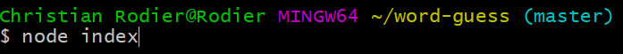

Made in Node.JS
1. Make sure to install require & inquire with npm in your CLI.
2. In your CLI, type node index.
3. The computer will choose a random word.
4. The dashes represent the amount of letters in the hidden word.
5. Guess a letter and hit enter. 
6. If the letter is correct the letter will appear in the hidden word otherwise guess again!

